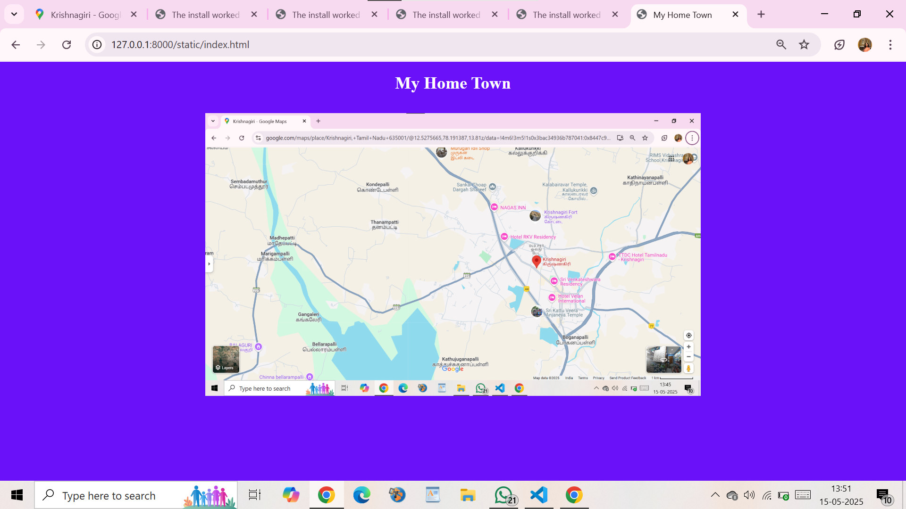
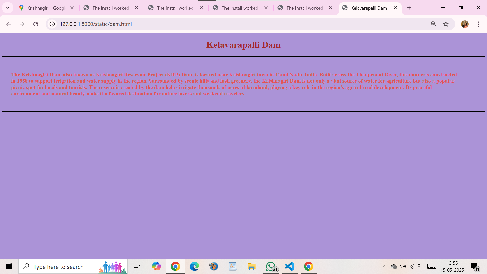
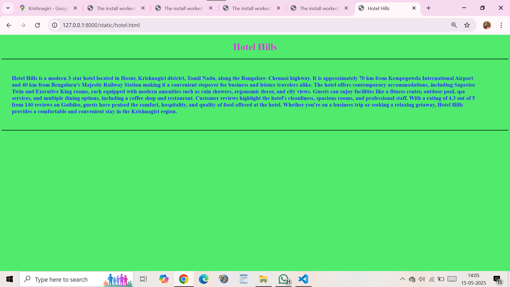
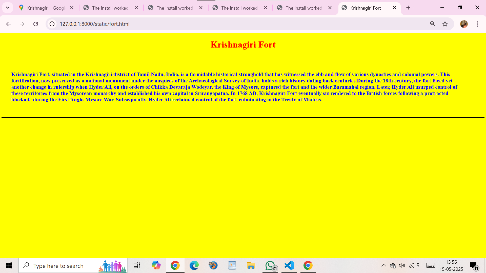
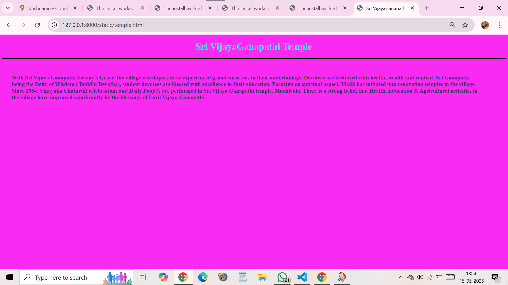

# Ex04 Places Around Me
## Date: 15/05/2025

## AIM
To develop a website to display details about the places around my house.

## DESIGN STEPS

### STEP 1
Create a Django admin interface.

### STEP 2
Download your city map from Google.

### STEP 3
Using ```<map>``` tag name the map.

### STEP 4
Create clickable regions in the image using ```<area>``` tag.

### STEP 5
Write HTML programs for all the regions identified.

### STEP 6
Execute the programs and publish them.

## CODE
```
index.html
<!DOCTYPE html>
<html lang="en">
<head>
   <meta charset="UTF-8">
   <meta name="viewport" content="width=device-width, initial-scale=1.0">
   <title>My Home Town</title>
   <style>
       img{
           padding-top: 1%;
       }
       h1{
           text-align: center;
           font-size: 48px;
           color: white;
       }
       body{
           background-color: rgb(106, 17, 250);
       }
   </style>
</head>
<body>
   <h1>My Home Town</h1>
   <center>
   <map name="image-map">
    <area target="" alt=" Bikkanapalli Falls" title="Bikkanapalli Falls" href="t1.html" coords="529,181,808,253"" shape="rect">
    <area target="" alt="The Krishnagiri Dam" title="The Krishnagiri Dam" href="t2.html" coords="77,175,356,247" shape="rect">
    <area target="" alt="Hotel Hills" title="Hotel Hills" href="t3.html" coords="660,263,939,335" shape="rect">
    <area target="" alt="Sri Vijaya Ganapathi Temple" title="Sri Vijaya Ganapathi Temple" href="t4.html" coords="916,621,1195,693" shape="rect">
    <area target="" alt="Arignar Anna Memorial Park" title="Arignar Anna Memorial Park" href="p.html" coords="247,438,526,510" shape="rect">

</map>
</body>
</html>
dam.html
<!DOCTYPE html>
<html lang="en">

<head>
    <meta charset="UTF-8">
    <meta name="viewport" content="width=device-width, initial-scale=1.0">
    <title>Kelavarapalli Dam</title>
    <style>
        h1 {
            color: brown;
            text-align: center;
            font-size: 48px;
        }

        p {
            padding-top: 2%;
            font-size: 28px;
            padding-right: 5%;
            padding-left: 2%;
            color: rgb(227, 83, 83);
        }


        body {
            background-color: rgb(171, 147, 215);
        }
    </style>
</head>

<body>
    <h1>Kelavarapalli Dam</h1>
    <hr color="black">
    <p><b>The Krishnagiri Dam, also known as Krishnagiri Reservoir Project (KRP) Dam, is located near 
        Krishnagiri town in Tamil Nadu, India. Built across the Thenpennai River, this dam was constructed 
        in 1958 to support irrigation and water supply in the region. Surrounded by scenic hills and lush greenery,
         the Krishnagiri Dam is not only a vital source of water for agriculture but also a popular picnic spot for
          locals and tourists. The reservoir created by the dam helps irrigate thousands of acres of farmland,
           playing a key role in the region’s agricultural development. Its peaceful environment and natural 
           beauty make it a favored destination for nature lovers and weekend travelers.
    </b></p>
    <br><br>
    <hr color="black">
</body>

</html>
hotel.html
<!DOCTYPE html>
<html lang="en">

<head>
    <meta charset="UTF-8">
    <meta name="viewport" content="width=device-width, initial-scale=1.0">
    <title>Hotel Hills</title>
    <style>
        h1 {
            color: rgb(210, 56, 221);
            text-align: center;
            font-size: 48px;
        }

        p {
            padding-top: 2%;
            font-size: 28px;
            padding-right: 5%;
            padding-left: 2%;
            color: rgb(41, 41, 238);
        }

        body {
            background-color: rgb(80, 235, 109);
        }
    </style>
</head>

<body>
    <h1>Hotel Hills</h1>
    <hr color="black">
    <p><b> Hotel Hills is a modern 3-star hotel located in Hosur, Krishnagiri district, Tamil Nadu, along the Bangalore–Chennai highway.
         It is approximately 70 km from Kempegowda International Airport and 40 km from Bengaluru's Majestic Railway Station making it a convenient stopover for business and leisure travelers alike. 
        The hotel offers contemporary accommodations, including Superior Twin and Executive King rooms, each equipped with modern amenities such as rain showers, ergonomic decor, and city views. 
        Guests can enjoy facilities like a fitness center, outdoor pool, spa services, and multiple dining options, including a coffee shop and restaurant. ​
        Customer reviews highlight the hotel's cleanliness, spacious rooms, and professional staff. With a rating of 4.3 out of 5 from 
        140 reviews on Goibibo, guests have praised the comfort, hospitality, and quality of food offered at the hotel. ​
        Whether you're on a business trip or seeking a relaxing getaway, Hotel Hills provides a comfortable and convenient stay in the Krishnagiri region.
</b></p>
    <br><br>
    <hr color="black">
</body>

</html>
fort.html
<!DOCTYPE html>
<html lang="en">

<head>
    <meta charset="UTF-8">
    <meta name="viewport" content="width=device-width, initial-scale=1.0">
    <title>Krishnagiri Fort</title>
    <style>
        h1 {
            color: red;
            text-align: center;
            font-size: 48px;
        }

        p {
            padding-top: 2%;
            font-size: 28px;
            padding-right: 5%;
            padding-left: 2%;
            color: blue;
        }

        body {
            background-color: yellow;
        }
    </style>
</head>

<body>
    <h1>Krishnagiri Fort</h1>
    <hr color="black">
    <p><b>
        Krishnagiri Fort, situated in the Krishnagiri district of Tamil Nadu, India, is a formidable
         historical stronghold that has witnessed the ebb and flow of various dynasties and colonial 
         powers. This fortification, now preserved as a national monument under the auspices of the
          Archaeological Survey of India, holds a rich history dating back centuries.During the 18th
           century, the fort faced yet another change in rulership when Hyder Ali, on the orders of Chikka
            Devaraja Wodeyar, the King of Mysore, captured the fort and the wider Baramahal region. 
            Later, Hyder Ali usurped control of these territories from the Mysorean monarchy and 
            established his own capital in Srirangapatna. In 1768 AD, Krishnagiri Fort eventually
             surrendered to the British forces following a protracted blockade during the First
        Anglo-Mysore War. Subsequently, Hyder Ali reclaimed control of the fort, 
        culminating in the Treaty of Madras.

        </b></p>
    <br><br>
    <hr color="black">
</body>

</html>
temple.html
<!DOCTYPE html>
<html lang="en">

<head>
    <meta charset="UTF-8">
    <meta name="viewport" content="width=device-width, initial-scale=1.0">
    <title>Sri VijayaGanapathi Temple</title>
    <style>
        h1 {
            color: rgb(48, 234, 221);
            text-align: center;
            font-size: 48px;
        }

        p {
            padding-top: 2%;
            font-size: 28px;
            padding-right: 5%;
            padding-left: 2%;
            color: rgb(59, 52, 104);
        }

        body {
            background-color: rgb(249, 42, 242);
        }
    </style>
</head>

<body>
    <h1>Sri VijayaGanapathi Temple</h1>
    <hr color="black">

    <p><b> With Sri Vijaya Ganapathi Swamy's Grace, the village worshipers have experienced grand successes 
        in their undertakings. Devotees are bestowed with health, wealth and content. Sri Ganapathi being 
        the Deity of Wisdom ( Buddhi Devatha), student devotees are blessed with excellence in their education.
        Focusing on spiritual aspect, MaSS has initiated into renovating temples in the village. Since 1984,
         Vinayaka Chaturthi celebrations and Daily Pooja's are performed in Sri Vijaya Ganapathi temple, Muchivolu.
          There is a strong belief that Health, Education & Agricultural activities in the village have improved 
          significantly by the blessings of Lord Vijaya Ganapathi.
    </b></p>

    <br><br>
    <hr color="black">
</body>

</html>

```

## OUTPUT










## RESULT
The program for implementing image maps using HTML is executed successfully.
